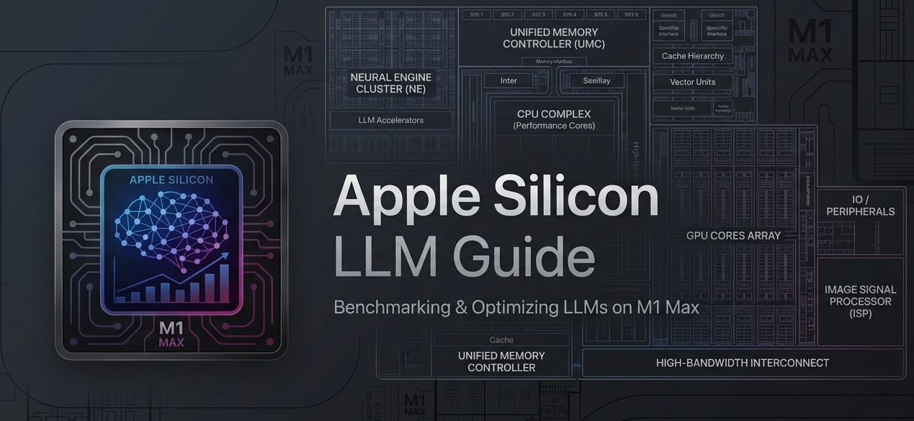

<p align="center">
  
</p>

<h1 align="center">apple-silicon-llm-guide</h1>

<p align="center">Benchmarks, setup guides, architecture patterns, and workarounds for running LLMs on Apple Silicon.</p>

<p align="center">
  <a href="#quick-start">Quick Start</a> ·
  <a href="#benchmark-highlights">Benchmarks</a> ·
  <a href="docs/guides/optimal-setup.md">Optimal Setup</a> ·
  <a href="#contributing">Contributing</a> ·
  <a href="#license">License</a>
</p>

<p align="center">
  <a href="https://opensource.org/licenses/MIT"></a>
  <a href="https://squidfunk.github.io/mkdocs-material/"></a>
  <a href="https://pages.github.com/"></a>
  <a href="https://j3n0v4.github.io/apple-silicon-llm-guide/"></a>
</p>

**Why this exists:**

> I bought a MacBook Pro M1 Max and wanted to find the best local LLM setup for the hardware. I benchmarked 9 models across 5 quantization formats on 64 GB unified memory. This project shares what I found — benchmarks, workarounds, and recommendations that actually work on Apple Silicon.

---

## Quick Start

Install Ollama and run a model in under 2 minutes:

```bash
# Install Ollama
brew install ollama

# Start the server
ollama serve

# Pull and run the best all-round model for 64 GB
ollama pull gemma4:e4b-nvfp4
ollama run gemma4:e4b-nvfp4
```

That is the complete setup. For the optimal configuration — GPU memory limit, swap-guard, model picks, co-residence pairs, context tuning, and a one-shot setup script — see the [Optimal Setup Guide](docs/guides/optimal-setup.md).

### Swap Management

Stale swap from previous model runs costs **28–31% tok/s** on small models — even with 40 GB of free RAM. macOS does not reclaim swap after models unload.

The permanent fix: install **swap-guard**, a launchd agent that monitors swap every 60 seconds and auto-purges when stale swap exceeds 1 GB:

```bash
cd scripts/
chmod +x install-swap-guard.sh
./install-swap-guard.sh
```

See the [Swap Impact page](docs/workarounds/swap-impact.md#automated-solution-swap-guard) for full details, or use `sudo purge` manually for one-off cleanup.

Read the full guide at [j3n0v4.github.io/apple-silicon-llm-guide](https://j3n0v4.github.io/apple-silicon-llm-guide/) for benchmarks, MLX setup, workarounds, and quantization comparisons.

---

**What it does:**

- **Benchmarks** — Token-generation speeds for dozens of model/quantization combos, with MLX engine comparisons and cold-start timing.
- **Setup Guides** — Apple silicon-specific configuration for Ollama, MLX, Open WebUI, and more. No generic Linux instructions.
- **Optimal Setup** — The complete best configuration for M1 Max 64 GB: GPU limit, swap-guard, model picks, co-residence pairs, and a one-shot setup script.
- **Architecture Patterns** — How to burst inference on local hardware and manage memory efficiently. Apple silicon unified memory is shared by CPU and GPU — great for bandwidth, but everything competes for the same pool.
- **Workarounds** — Known bugs: the `/no_think` bug, context-length footguns, thinking-model quirks, flash attention tuning, and why speculative decoding is not worth it on this hardware.
- **Quantization** — Practical guidance on GGUF, NVFP4, MXFP8, Q4_K_M, and other formats. Which ones actually matter on Apple silicon.

---

## TL;DR — Which Model Should You Use?

| Model | Best For | Throughput | Quality | RAM Budget |
|-------|----------|-----------|---------|------------|
| **gemma4:e2b-nvfp4** | Maximum speed — chat, summarization, high-throughput | **93.1 tok/s** | 9/10 | ~6.8 GB |
| **qwen3-coder:30b** | Best coding & tool calling | 55.7 tok/s | **10/10** | ~33 GB |
| **gemma4:e4b-nvfp4** | Best value — balanced general use | 60.4 tok/s | 8/10 | ~9.3 GB |
| **qwen3.6:35b-a3b-nvfp4** | Most efficient — MoE, 3B active params | 54.3 tok/s | 9/10 | ~22 GB |
| **deepseek-r1:14b** | Deep reasoning / chain-of-thought | 22.2 tok/s | **10/10** | ~49 GB |

---

## Benchmark Highlights

All numbers from a MacBook Pro M1 Max (64 GB) via Ollama's `/api/generate` endpoint.

| Metric | Model | Result |
|--------|-------|--------|
| **Fastest** | gemma4:e2b-nvfp4 | **93.1 tok/s** — nearly 2× faster than anything else |
| **Best quality** | qwen3-coder:30b | **10/10** quality at 55.7 tok/s — the coding king |
| **Best value** | gemma4:e4b-nvfp4 | **60.4 tok/s**, 8/10 quality, only 9.3 GB RAM |
| **Most efficient** | qwen3.6:35b-a3b-nvfp4 | **54.3 tok/s**, 9/10 quality — 35B params, only 3B active |

Full data with charts, cold-start times, and memory breakdowns on the [Benchmarks](docs/benchmarks/index.md) page.

---

## Test Hardware

All benchmarks and instructions were tested on:

| Spec | Value |
|------|-------|
| **Machine** | MacBook Pro (2021) |
| **SoC** | Apple M1 Max |
| **CPU** | 10 cores (8 performance + 2 efficiency) |
| **GPU** | 24 cores |
| **Memory** | 64 GB unified memory (400 GB/s) |
| **Storage** | 2 TB SSD (APFS) |
| **OS** | macOS 26.6 (Tahoe) |

Results scale to other M-series chips by memory bandwidth and GPU core count. This repo is updated as new models and quantizations become available.

---

## Contributing

Contributions are welcome — especially benchmark data from other Apple silicon machines. Benchmark data from M2, M3, M4, or machines with more than 64 GB is particularly valuable.

**How to contribute benchmarks:**

1. Run the benchmark script from `docs/benchmarks/methodology.md` on your machine
2. Add your results to the appropriate table in `docs/benchmarks/model-comparison.md`
3. Include your hardware specs (chip, RAM, GPU cores, macOS version)
4. Open a pull request

**Other contributions:** bug fixes, new workarounds, setup guides for configurations not yet covered. Fork the repo, create a branch, run `mkdocs build --strict` to verify, and open a PR.

## License

[MIT](LICENSE) &copy; 2026 JD Cordero
