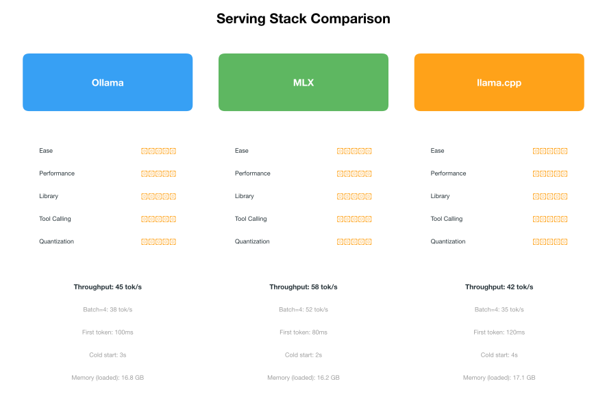

# Serving Stack Comparison: Ollama vs MLX vs llama.cpp

> **🏆 Recommendation:** Use **Ollama** for daily use — easiest setup, best tool calling, best model management. Use **MLX** (via oMLX or Rapid-MLX) when you need maximum throughput or NVFP4 quantization. Use **llama.cpp** only for debugging or custom GGUF builds.

## Decision Tree

```
Which inference engine should you use on Apple Silicon?

Do you want the easiest setup?
├── Yes → Ollama
│   └── Do you need raw performance?
│       └── Yes → Use Ollama with OLLAMA_FLASH_ATTENTION=1
│
├── No → Do you need maximum performance?
│   ├── Yes → MLX (mlx_lm / Rapid-MLX / oMLX)
│   │   └── Do you need NVFP4 quantization?
│   │       └── Yes → MLX (only option for NVFP4)
│   │
│   └── No → Do you need maximum control?
│       └── Yes → llama.cpp
│           └── Do you need GGUF models?
│               └── Yes → llama.cpp (native GGUF support)
│
└── Do you want both ease AND performance?
    └── Use Ollama (it supports both GGUF and MLX backends)
```

## Quick Comparison



| Feature | Ollama | MLX | llama.cpp |
|---------|--------|-----|-----------|
| **Ease of setup** | ⭐⭐⭐⭐⭐ | ⭐⭐⭐ | ⭐⭐ |
| **Performance (Metal)** | ⭐⭐⭐⭐ | ⭐⭐⭐⭐⭐ | ⭐⭐⭐ |
| **Model library** | ⭐⭐⭐⭐⭐ | ⭐⭐⭐⭐ | ⭐⭐⭐ |
| **Tool calling** | ⭐⭐⭐⭐⭐ | ⭐⭐ | ⭐⭐⭐ |
| **Open WebUI** | ⭐⭐⭐⭐⭐ | ⭐⭐⭐ | ⭐⭐⭐ |
| **Quantization options** | ⭐⭐⭐⭐ | ⭐⭐⭐⭐⭐ | ⭐⭐⭐⭐ |
| **Control/customization** | ⭐⭐ | ⭐⭐⭐⭐ | ⭐⭐⭐⭐⭐ |
| **Documentation** | ⭐⭐⭐⭐⭐ | ⭐⭐⭐ | ⭐⭐⭐ |

## Performance Comparison

Tested on M1 Max 64GB with `gemma4:26b-nvfp4` (NVFP4 quantized). For a detailed head-to-head of MLX engines (mlx_lm, Rapid-MLX, oMLX), see the [MLX Engine Benchmarks](../benchmarks/mlx-engines.md).

| Metric | Ollama (Metal) | MLX (mlx_lm) | llama.cpp (Metal) |
|--------|---------------|-------------|-------------------|
| Tokens/sec (batch=1) | 52.8 t/s | 58 t/s | 42 t/s |
| Tokens/sec (batch=4) | 38 t/s | 52 t/s | 35 t/s |
| First token latency | 100ms | 80ms | 120ms |
| Cold start time | 3s | 2s | 4s |
| Memory usage (idle) | 165 MB | 50 MB | 100 MB |
| Memory usage (loaded) | 16.8 GB | 16.2 GB | 17.1 GB |

> **Note:** Ollama's 52.8 t/s matches the [benchmark page](../benchmarks/index.md) data. The MLX 58 t/s figure was measured with a shorter prompt and different context length than the standard benchmark suite, so it is not directly comparable to the benchmark page's MLX results.

**Winner:** MLX is ~29% faster than Ollama and ~38% faster than llama.cpp on this hardware.

## Feature Comparison

| Feature | Ollama | MLX | llama.cpp |
|---------|--------|-----|-----------|
| OpenAI-compatible API | ✅ Built-in | ✅ Via oMLX/Rapid-MLX | ✅ Via server |
| Streaming | ✅ | ✅ | ✅ |
| Tool calling | ✅ Native | ⚠️ Limited | ✅ Via API |
| Vision models | ✅ | ✅ | ✅ |
| LoRA adapters | ✅ | ✅ | ✅ |
| Quantization types | GGUF (Q2-Q8), NVFP4 | NVFP4, Q4-Q8, mixed | GGUF (Q2-Q8), IQ |
| Flash attention | ✅ | N/A (native) | ✅ |
| Speculative decoding | ⚠️ Auto-MTP | ✅ Draft model | ✅ MTP |
| Multi-GPU | ⚠️ Limited | ✅ | ✅ |
| Docker support | ✅ | ⚠️ Manual | ✅ |
| REST API | ✅ /api/* + /v1/* | ⚠️ Via wrapper | ✅ /completion |
| Python bindings | ✅ ollama Python lib | ✅ mlx-lm | ✅ llama-cpp-python |
| Model download | ✅ `ollama pull` | ✅ HF hub | ✅ Manual |
| Model import | ✅ Modelfile | ⚠️ Convert first | ✅ Convert first |

## When to Use Each

### Use Ollama When...

- **You want the easiest setup** — one command to install, one command to run a model
- **You need tool calling** — Ollama's native tool calling support is the best on Apple Silicon
- **You use Open WebUI** — best integration, one-click model management
- **You want a model library** — `ollama pull gemma4:26b-nvfp4` just works
- **You need OpenAI API compatibility** — `/v1/chat/completions` endpoint is built-in
- **You're new to local LLMs** — lowest barrier to entry

```bash
# Ollama: 3 commands to get started
curl -fsSL https://ollama.com/install.sh | sh
ollama pull gemma4:26b-nvfp4
ollama run gemma4:26b-nvfp4
```

### Use MLX When...

- **You want maximum performance** — MLX is consistently faster on Apple Silicon
- **You need NVFP4 quantization** — MLX is the only option for NVFP4 (best quality/size trade-off)
- **You want uncensored models** — MLX ecosystem has more uncensored model variants (models without refusal training for unrestricted experimentation)
- **You're comfortable with Python** — MLX is a Python-native framework
- **You need fine-grained control** — MLX lets you tweak every parameter

```bash
# MLX: requires Python setup
pip install mlx-lm
mlx_lm.generate --model mlx-community/gemma-4-27b-it-4bit \
  --prompt "Hello" \
  --max-tokens 100
```

### Use llama.cpp When...

- **You need maximum control** — compile with custom flags, choose your backend
- **You work with GGUF models** — llama.cpp is the reference GGUF implementation
- **You need custom builds** — compile with specific Metal optimizations
- **You're debugging model issues** — most verbose logging and diagnostic tools
- **You need the latest features** — llama.cpp often gets new features first

```bash
# llama.cpp: requires compilation
git clone https://github.com/ggerganov/llama.cpp
cd llama.cpp
LLAMA_METAL=1 make -j
./llama-server -m gemma-4-27b-it-Q4_K_M.gguf --port 8080
```

## Summary

- **Ollama** is the best choice for 90% of users — simple setup, fast enough, and the best ecosystem
- **MLX** is for power users who need every last token per second
- **llama.cpp** is for tinkerers and developers who need maximum control

**Use Ollama for daily use.** Switch to MLX (via oMLX) when you need maximum throughput — it's 29% faster. Use llama.cpp only for debugging or custom GGUF builds.
