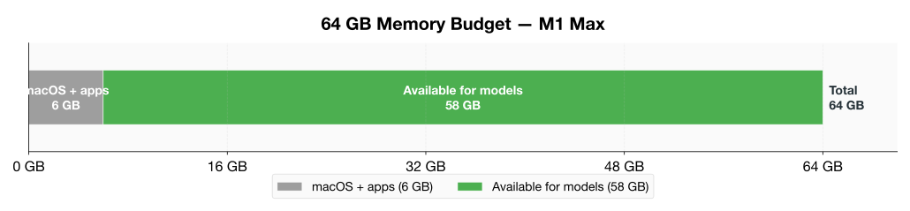
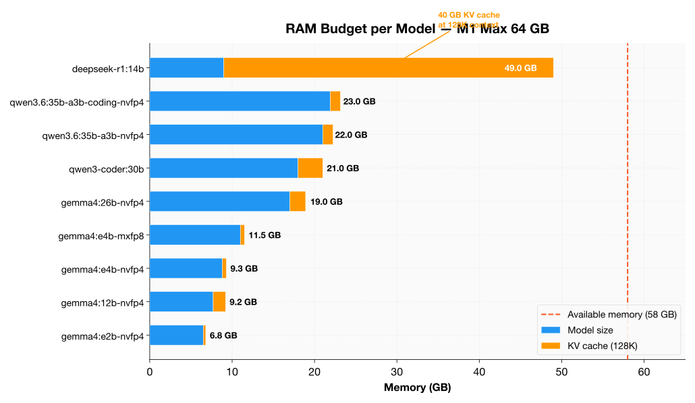

# Co-Residence Guide

Running multiple models simultaneously on a single Mac allows you to specialize — use a fast model for simple queries and a powerful model for complex reasoning. This guide shows which model pairs fit in **64 GB unified memory** and how to configure them.

## Memory Budget

On a 64 GB Mac, the usable memory for models is approximately **55–58 GB** after accounting for macOS overhead (~5–6 GB) and other running applications.





## Model Memory Requirements

| Model | Model Size | KV Cache (128K) | Total Budget |
|-------|-----------|-----------------|-------------|
| gemma4:e2b-nvfp4 | 6.5 GB | ~0.3 GB | **~6.8 GB** |
| gemma4:e4b-nvfp4 | 8.8 GB | ~0.5 GB | **~9.3 GB** |
| gemma4:12b-nvfp4 | 7.7 GB | ~1.5 GB | **~9.2 GB** |
| gemma4:26b-nvfp4 | 17 GB | 1.92 GB | **~19 GB** |
| qwen3-coder:30b | 18 GB | 3.0 GB | **~21 GB** |
| qwen3.6:35b-a3b-nvfp4 | 21 GB | 1.25 GB | **~22 GB** |
| qwen3.6:35b-a3b-coding-nvfp4 | 21.9 GB | 1.25 GB | **~23 GB** |
| deepseek-r1:14b | 9.0 GB | 40 GB | **~49 GB** |

!!! warning "KV cache is the hidden cost"
    DeepSeek R1 14B's model is only 9 GB, but its KV cache at 128K context is **40 GB** — making it the most memory-hungry model despite its small size. Check KV cache requirements, not just model size.

## Pairing Guide

### Pairs That Fit Comfortably (≤ 55 GB total)

| Pair | Total | Headroom | Best For |
|------|-------|----------|----------|
| gemma4:e4b-nvfp4 + qwen3-coder:30b | ~30 GB | **25 GB** | General + Coding — the ultimate combo |
| gemma4:e4b-nvfp4 + gemma4:26b-nvfp4 | ~28 GB | **27 GB** | Fast chat + Deep reasoning |
| gemma4:e2b-nvfp4 + qwen3-coder:30b | ~28 GB | **27 GB** | Max speed + Coding |
| gemma4:e2b-nvfp4 + gemma4:26b-nvfp4 | ~26 GB | **29 GB** | Max speed + Deep reasoning |
| gemma4:e4b-nvfp4 + qwen3.6:35b-a3b-nvfp4 | ~31 GB | **24 GB** | General + MoE reasoning |
| gemma4:e2b-nvfp4 + qwen3.6:35b-a3b-nvfp4 | ~29 GB | **26 GB** | Max speed + MoE reasoning |
| gemma4:e4b-nvfp4 + qwen3.6:35b-a3b-coding-nvfp4 | ~32 GB | **23 GB** | General + MoE coding |
| gemma4:e2b-nvfp4 + qwen3.6:35b-a3b-coding-nvfp4 | ~30 GB | **25 GB** | Max speed + MoE coding |
| gemma4:e4b-nvfp4 + gemma4:e4b-nvfp4 | ~19 GB | **36 GB** | Two fast general models (redundancy) |
| gemma4:e2b-nvfp4 + gemma4:e4b-nvfp4 | ~16 GB | **39 GB** | Speed + General |
| gemma4:e2b-nvfp4 + gemma4:12b-nvfp4 | ~16 GB | **39 GB** | Speed + Memory-efficient reasoning |
| gemma4:e4b-nvfp4 + gemma4:12b-nvfp4 | ~19 GB | **36 GB** | General + Memory-efficient reasoning |

### Pairs That Fit Tightly (55–58 GB total)

| Pair | Total | Headroom | Notes |
|------|-------|----------|-------|
| deepseek-r1:14b + gemma4:e2b-nvfp4 | ~56 GB | **2 GB** | Tight — works if you keep context short |
| deepseek-r1:14b + gemma4:e4b-nvfp4 | ~58 GB | **0 GB** | At the limit — reduce KV cache or context length |
| qwen3-coder:30b + qwen3.6:35b-a3b-nvfp4 | ~43 GB | **12 GB** | Comfortable — two heavy models |
| qwen3-coder:30b + gemma4:26b-nvfp4 | ~40 GB | **15 GB** | Comfortable |

### Pairs That Do NOT Fit

| Pair | Total | Why |
|------|-------|-----|
| deepseek-r1:14b + qwen3-coder:30b | ~70 GB | Exceeds 64 GB by 6 GB |
| deepseek-r1:14b + gemma4:26b-nvfp4 | ~68 GB | Exceeds 64 GB by 4 GB |
| deepseek-r1:14b + qwen3.6:35b-a3b-nvfp4 | ~71 GB | Exceeds 64 GB by 7 GB |
| deepseek-r1:14b + deepseek-r1:14b | ~98 GB | Two reasoning models — impossible |
| qwen3-coder:30b + qwen3-coder:30b | ~42 GB | Fits! But wasteful — use one coder |
| qwen3.6:35b-a3b-nvfp4 + qwen3.6:35b-a3b-nvfp4 | ~44 GB | Fits! But wasteful |

## Recommended Pairings

### The "Developer" Stack

```yaml
# Two models running simultaneously
models:
  - name: gemma4:e4b-nvfp4
    role: Fast chat / quick queries
    port: 11434
    context: 8192  # Short context for speed

  - name: qwen3-coder:30b
    role: Code generation / complex tasks
    port: 11435
    context: 32768  # Longer context for code
```

**Total memory:** ~30 GB — leaves 25 GB for macOS and headroom.

### The "Reasoning" Stack

```yaml
models:
  - name: gemma4:e2b-nvfp4
    role: Fast chat / simple queries
    port: 11434
    context: 8192

  - name: gemma4:26b-nvfp4
    role: Deep reasoning / analysis
    port: 11435
    context: 32768
```

**Total memory:** ~26 GB — leaves 29 GB for macOS and headroom.

### The "MoE Power" Stack

```yaml
models:
  - name: gemma4:e4b-nvfp4
    role: Fast chat
    port: 11434
    context: 8192

  - name: qwen3.6:35b-a3b-coding-nvfp4
    role: MoE coding / complex tasks
    port: 11435
    context: 32768
```

**Total memory:** ~32 GB — leaves 23 GB for macOS and headroom.

## Context Length Tradeoffs

Reducing context length frees KV cache memory, allowing tighter pairs to fit:

| Model | KV Cache at 128K | KV Cache at 32K | KV Cache at 8K |
|-------|-----------------|-----------------|----------------|
| deepseek-r1:14b | 40 GB | **10 GB** | **2.5 GB** |
| qwen3-coder:30b | 3.0 GB | 0.75 GB | 0.19 GB |
| gemma4:26b-nvfp4 | 1.92 GB | 0.48 GB | 0.12 GB |
| gemma4:e4b-nvfp4 | ~0.5 GB | ~0.13 GB | ~0.03 GB |

!!! tip "Making DeepSeek R1 fit with a partner"
    If you reduce DeepSeek R1's context to 32K, its KV cache drops from 40 GB to 10 GB, bringing its total budget to ~19 GB. This frees enough memory to pair it with gemma4:e4b-nvfp4 (~9 GB) for a total of ~28 GB — very comfortable.

## Running Multiple Models

### With Ollama

Ollama keeps loaded models in memory by default. To run two models simultaneously:

```bash
# Terminal 1: Start first model
ollama run gemma4:e4b-nvfp4

# Terminal 2: Start second model (in another terminal)
ollama run qwen3-coder:30b
```

Ollama will keep both in memory as long as they fit. If memory runs low, it will unload the least recently used model.

### With MLX Engines

Each MLX engine instance loads its model independently:

```bash
# Terminal 1: Serve first model on port 8080
omlx serve --model gemma4:e4b-nvfp4 --port 8080

# Terminal 2: Serve second model on port 8081
omlx serve --model qwen3-coder:30b --port 8081
```

### With Open WebUI

Open WebUI can manage multiple models and route requests based on your selection:

1. Configure both models in Open WebUI's model list
2. Select the appropriate model for each conversation
3. Open WebUI keeps both loaded and routes requests to the active model

## Monitoring Memory Usage

```bash
# Check total memory pressure
memory_pressure

# Check per-process memory (Ollama)
ps aux | grep ollama

# Check per-process memory (MLX)
ps aux | grep mlx

# macOS activity monitor (GUI)
open -a "Activity Monitor"
```

## What I Learned

1. **Gemma 4 e4b-nvfp4 pairs with everything** — its 9.3 GB budget leaves room for any other model
2. **DeepSeek R1 14B is the pairing challenge** — its 40 GB KV cache dominates memory; reduce context to 32K to make it pair-friendly
3. **The best all-around pair is gemma4:e4b-nvfp4 + qwen3-coder:30b** — fast chat + excellent coding, only 30 GB total
4. **You can run 3+ small models** — gemma4:e2b-nvfp4 (6.8 GB) + gemma4:e4b-nvfp4 (9.3 GB) + gemma4:12b-nvfp4 (9.2 GB) = ~25 GB total
5. **Always account for KV cache** — model size alone is misleading; DeepSeek R1's 9 GB model needs 49 GB total at 128K context
