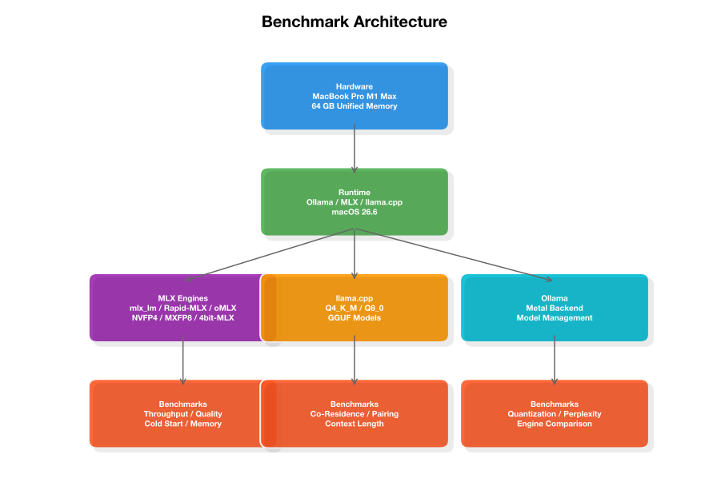

# Benchmarks Overview

> **🏆 Quick Picks (MacBook Pro M1 Max 64 GB):** See the [homepage TL;DR](../index.md) for the full quick-picks table. In summary: Best all-around → **gemma4:26b-nvfp4** (52.8 tok/s, 9/10 quality). Best coding → **qwen3-coder:30b** (55.7 tok/s, 10/10 quality). Best MoE → **qwen3.6:35b-a3b-nvfp4** (54.3 tok/s, 9/10 quality). Best small → **gemma4:e4b-nvfp4** (60.4 tok/s, 8/10 quality). Best reasoning → **deepseek-r1:14b** (10/10 quality, but memory-hungry).

This section provides reproducible benchmarks for running large language models on Apple Silicon. All measurements were taken on a **MacBook Pro M1 Max (64 GB unified memory)** running **macOS 26.6** — see the [Methodology](methodology.md) page for the complete hardware configuration and measurement approach. Results scale to other M-series chips by memory bandwidth and GPU core count.

## Key Findings

- **Gemma 4 delivers the best throughput-to-quality ratio** on Apple Silicon. The `gemma4:e4b-nvfp4` variant hits 60.4 tok/s with 8/10 quality, while `gemma4:26b-nvfp4` reaches 52.8 tok/s at 9/10 quality — both with excellent cold-start times under 3.5 seconds.
- **Qwen 3.6 35B-A3B is the MoE sweet spot.** The 35B-parameter model with 3B active parameters achieves 54.3 tok/s at 9/10 quality, rivaling dense 30B models at half the memory footprint.
- **Qwen 3 Coder 30B is the top coding model** at 55.7 tok/s with 10/10 quality, but requires 3 GB KV cache at 128K context — plan memory accordingly.
- **DeepSeek R1 14B is the thinking/reasoning champion** at 10/10 quality, but its 40 GB KV cache at 128K context makes it a memory hog — it can only co-reside with tiny models on 64 GB systems.
- **NVFP4 quantization is the default recommendation** — it offers the best perplexity-to-speed tradeoff (17.95 vs BF16 baseline 17.54) and is MLX-native.
- **MLX engines vary wildly in prefill performance.** oMLX leads effective throughput (170.7 eff tok/s) while Rapid-MLX leads generation speed (51.4 gen tok/s) but has high prefill overhead.
- **API overhead is real.** `/v1/chat/completions` is 33–37% slower than `/api/generate` on the same engine.

## Summary Performance Table

| Model | Throughput | Quality | Disk | KV Cache (128K) | Cold Start |
|-------|-----------|---------|------|-----------------|------------|
| gemma4:e2b-nvfp4 | 93.1 tok/s | 9/10 | 6.5 GB | ~0.3 GB | 1.51s |
| gemma4:e4b-mxfp8 | 63.0 tok/s | 8/10 | 11 GB | ~0.5 GB | 3.0s |
| gemma4:e4b-nvfp4 | 60.4 tok/s | 8/10 | 8.8 GB | ~0.5 GB | 2.0s |
| qwen3-coder:30b | 55.7 tok/s | 10/10 | 18 GB | 3.0 GB | 7.8s |
| qwen3.6:35b-a3b-nvfp4 | 54.3 tok/s | 9/10 | 21 GB | 1.25 GB | 5.0s |
| qwen3.6:35b-a3b-coding-nvfp4 | 53.9 tok/s | 10/10 | 21.9 GB | 1.25 GB | 2.68s |
| gemma4:26b-nvfp4 | 52.8 tok/s | 9/10 | 17 GB | 1.92 GB | 3.4s |
| gemma4:12b-nvfp4 | 28.7 tok/s | 9/10 | 7.7 GB | ~1.5 GB | 2.1s |
| deepseek-r1:14b | 22.2 tok/s | 10/10 | 9.0 GB | 40 GB | 2.79s |

## Architecture Overview

The following diagram shows how the benchmark testbed is organized:

## Benchmark Categories

| Section | Description |
|---------|-------------|
| [Model Comparison](model-comparison.md) | Full comparison of all tested models — throughput, quality, memory, cold start |
| [MLX Engines](mlx-engines.md) | Head-to-head of mlx_lm, Rapid-MLX, and oMLX on the same model |
| [Quantization Guide](quantization.md) | NVFP4 vs MXFP8 vs MXFP4 vs Q4_K_M vs Q8_0 — perplexity, speed, file size |
| [Co-Residence Guide](co-residence.md) | Which model pairs fit in 64 GB — pairing strategies and memory budgets |
| [Tool Calling](tool-calling.md) | Function-calling compatibility matrix — single, parallel, required |
| [Methodology](methodology.md) | How to reproduce these benchmarks — test battery, measurement approach, scripts |

## Hardware Context

All benchmarks were run on the test machine described in the [Methodology](methodology.md) page. See that page for the complete hardware configuration, software versions, and measurement approach.

!!! tip "Scaling to other hardware"
    M1/M2/M3/M4 Max and Pro chips see proportionally lower throughput based on GPU core count and memory bandwidth. Use the [Model Selection Guide](../guides/model-selection.md) to scale expectations for your hardware.
