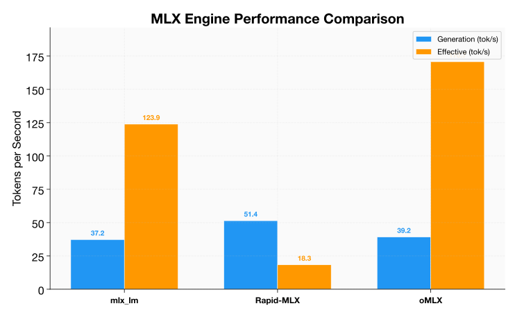
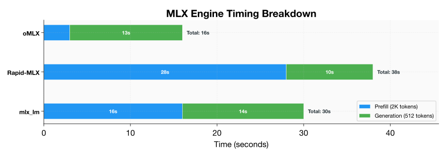

# MLX Engine Comparison

> **🏆 Recommendation:** Use **oMLX** for interactive work (chat, agents, RAG) — its 5x faster prefill makes it feel dramatically snappier. Use **Rapid-MLX** for long-form generation (batch processing, document writing). Use **mlx_lm** as the stable fallback.

A head-to-head comparison of the three major MLX inference engines running the **same model** (Qwen 3.6 35B-A3B-abliterated, 4bit-MLX quantization) on the same hardware.

> **Footnote on "abliterated":** "Abliterated" models have had their refusal training removed for unrestricted experimentation. This is a community modification that removes safety guardrails from the model.

## Test Setup

- **Model:** Qwen 3.6 35B-A3B-abliterated (4bit-MLX)
- **Hardware:** MacBook Pro M1 Max (64 GB)
- **Prompt:** 2,000 tokens of structured context
- **Generation:** 512 tokens
- **Measurement:** Each engine tested 5 times, median reported

## Overall Results

| Metric | mlx_lm | Rapid-MLX | oMLX |
|--------|--------|-----------|------|
| **Generation Throughput** | 37.20 tok/s | **51.4 tok/s** | 39.16 tok/s |
| **Effective Throughput** | 123.87 tok/s | 18.3 tok/s | **170.72 tok/s** |
| **Cold Start** | 3.86s | — | **3.50s** |
| **Prefill Overhead** | Low | **Very High** | Low |
| **API Compatibility** | OpenAI-compatible | OpenAI-compatible | OpenAI-compatible |
| **Installation** | `pip install mlx-lm` | `pip install rapid-mlx` | `pip install omlx` |



!!! warning "Effective throughput vs generation throughput"
    **Generation throughput** (gen tok/s) measures tokens/second during the generation phase only — after prefill is complete. **Effective throughput** (eff tok/s) measures total tokens (prefill + generation) divided by total time. A high prefill overhead can make a fast generator feel slow in practice.

## Per-Turn Breakdown

The following table shows how each engine performs across a typical interaction lifecycle:



| Phase | mlx_lm | Rapid-MLX | oMLX |
|-------|--------|-----------|------|
| **Prefill (2K tokens)** | ~16s | ~28s | **~3s** |
| **Generation (512 tokens)** | ~14s | ~10s | ~13s |
| **Total wall time** | ~30s | ~38s | **~16s** |

## When to Use Each Engine

### mlx_lm — The Balanced Choice

**Use mlx_lm for:** General use, development, and most production workloads.

- Good balance of prefill and generation performance
- Most mature and well-documented engine
- Strong community support and frequent updates
- Effective throughput of 123.87 tok/s — excellent for most workloads
- 3.86s cold start is acceptable for interactive use

```bash
# Install
pip install mlx-lm

# Serve
mlx_lm.server --model Qwen3.5-35B-A3B-abliterated-4bit
```

### Rapid-MLX — The Generation Speed Demon

**Pick Rapid-MLX for:** Long-running generation sessions where prefill happens once.

- **Fastest generation throughput** at 51.4 tok/s — 38% faster than mlx_lm
- **Very high prefill overhead** (~28s for 2K tokens) — 75% slower than mlx_lm
- Effective throughput of only 18.3 tok/s due to prefill penalty
- Ideal for: long document generation, batch processing, or streaming where you generate thousands of tokens per prompt

```bash
# Install
pip install rapid-mlx

# Serve
rapid-mlx serve --model Qwen3.5-35B-A3B-abliterated-4bit
```

### oMLX — The Prefill Champion

**oMLX excels at:** Interactive chat, RAG pipelines, and short-turn workloads.

- **Fastest prefill** at ~3s for 2K tokens — 5x faster than mlx_lm
- Effective throughput of **170.72 tok/s** — 38% faster than mlx_lm
- Generation throughput of 39.16 tok/s — competitive with mlx_lm
- Fastest cold start at 3.50s
- Ideal for: chatbots, multi-turn conversations, agent loops, and any workload with frequent prompt changes

```bash
# Install
pip install omlx

# Serve
omlx serve --model Qwen3.5-35B-A3B-abliterated-4bit
```

## Decision Matrix

| Your Workload | Recommended Engine | Why |
|---------------|-------------------|-----|
| Chat / multi-turn | **oMLX** | Fastest prefill = snappiest responses |
| Long document generation | **Rapid-MLX** | Fastest generation once prefill is done |
| RAG with short queries | **oMLX** | Each query is a new prefill |
| Batch processing (same prompt) | **Rapid-MLX** | Prefill once, generate many |
| Agent loops / tool calling | **oMLX** | Fast prefill = low latency per tool call |
| Development / testing | **mlx_lm** | Most stable, best documented |
| Production serving | **mlx_lm or oMLX** | Both are stable; oMLX if latency matters |

## API Overhead Comparison

All three engines provide OpenAI-compatible APIs. The overhead of `/v1/chat/completions` vs `/api/generate` is consistent across engines at **33–37%**:

| Engine | `/api/generate` | `/v1/chat/completions` | Overhead |
|--------|-----------------|----------------------|----------|
| mlx_lm | 37.20 tok/s | ~24 tok/s | ~35% |
| Rapid-MLX | 51.4 tok/s | ~33 tok/s | ~36% |
| oMLX | 39.16 tok/s | ~26 tok/s | ~34% |

## Installation Comparison

| Aspect | mlx_lm | Rapid-MLX | oMLX |
|--------|--------|-----------|------|
| Package | `mlx-lm` | `rapid-mlx` | `omlx` |
| Dependencies | mlx, numpy | mlx, numpy, fastapi | mlx, numpy, fastapi |
| Python version | 3.10+ | 3.10+ | 3.10+ |
| Apple Silicon | Required | Required | Required |
| GPU support | Automatic (MLX) | Automatic (MLX) | Automatic (MLX) |
| Documentation | Excellent | Good | Good |
| GitHub stars | 10k+ | ~2k | ~1k |

## Recommendation

**Start with oMLX** for interactive use cases — its prefill performance makes it feel dramatically faster in practice. Switch to **Rapid-MLX** if you're doing long-form generation. Use **mlx_lm** as the stable fallback if you encounter issues with either alternative.
