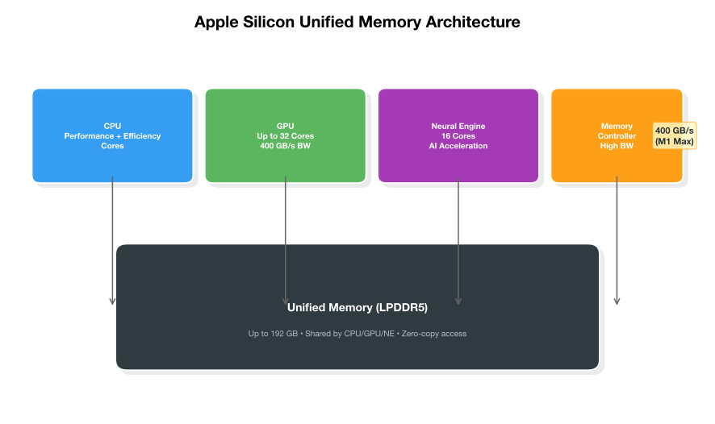

# Memory Management Guide

Apple Silicon's unified memory is shared by CPU and GPU — great for bandwidth, but everything competes for the same pool. Memory is the bottleneck. Here's how to manage it.

## Apple Silicon Unified Memory Architecture

Unlike traditional computers with separate CPU RAM and GPU VRAM, Apple Silicon uses a **unified memory pool** shared by the CPU, GPU, Neural Engine, and other coprocessors.



### Key Properties

- **No copying**: CPU and GPU access the same memory — no PCIe transfer overhead
- **Zero-copy inference**: Model weights are read directly from shared memory
- **Bandwidth**: M1: 68 GB/s, M1 Pro: 200 GB/s, M1 Max: 400 GB/s, M2 Ultra: 800 GB/s
- **Capacity**: 8 GB (base M1/M2) to 192 GB (M2 Ultra)

### The Trade-off

The unified architecture means **everything competes for the same memory**:

- macOS system processes
- Your browser with 50 tabs
- VS Code with extensions
- The LLM model weights
- The KV cache during generation
- Other GPU workloads

## GPU Memory Limit

macOS enforces a soft limit on GPU-addressable memory via the `iogpu.wired_limit_mb` sysctl.

### Default Limits

```bash
# Check current GPU memory limit
sysctl iogpu.wired_limit_mb
```

| Total RAM | Default GPU Limit | Percentage |
|-----------|-----------------|------------|
| 8 GB | ~5,120 MB | ~62% |
| 16 GB | ~10,240 MB | ~62% |
| 32 GB | ~20,480 MB | ~62% |
| 64 GB | ~48,000 MB | ~73% |
| 128 GB | ~57,344 MB | ~44% |
| 192 GB | ~57,344 MB | ~29% |

### Raising the GPU Memory Limit

For 64 GB+ systems, you can raise the limit:

```bash
# Check current limit
sysctl iogpu.wired_limit_mb

# Raise to 57344 MB (56 GB) — requires sudo
sudo sysctl iogpu.wired_limit_mb=57344

# Make permanent (add to /etc/sysctl.conf)
echo "iogpu.wired_limit_mb=57344" | sudo tee -a /etc/sysctl.conf
```

**Warning**: Raising the limit too high causes system instability. macOS needs memory for the UI, kernel, and apps. If the GPU consumes too much, the system hangs or force-kills apps.

### Safe Limits by RAM

| Total RAM | Safe GPU Limit | Max Recommended |
|-----------|---------------|----------------|
| 8 GB | 4,096 MB | 5,120 MB |
| 16 GB | 8,192 MB | 10,240 MB |
| 32 GB | 20,480 MB | 24,576 MB |
| 64 GB | 48,000 MB | 57,344 MB |
| 128 GB | 57,344 MB | 96,000 MB |
| 192 GB | 57,344 MB | 128,000 MB |

## KV Cache Calculation

The KV cache stores key-value pairs from previous tokens during generation. It grows linearly with context length.

### Formula

```
KV Cache (bytes) = context_length × num_layers × kv_heads × head_dim × bytes_per_element × 2
```

Where:
- `context_length`: Number of tokens in the context window
- `num_layers`: Number of transformer layers
- `kv_heads`: Number of key/value attention heads
- `head_dim`: Dimension of each attention head (typically 128)
- `bytes_per_element`: 2 for FP16, 1 for Q8_0, 0.5 for Q4_0
- `× 2`: Separate K and V caches

### Simplified Formula

```
KV Cache (GB) = context_length × num_layers × kv_heads × 128 × bytes_per_element × 2 / 1,073,741,824
```

### Calculator Script

```python
#!/usr/bin/env python3
"""Calculate KV cache memory for a given model configuration."""

def kv_cache_gb(context_length, num_layers, kv_heads, head_dim=128, bits=8):
    """Calculate KV cache size in GB."""
    bytes_per_element = bits / 8
    bytes_total = context_length * num_layers * kv_heads * head_dim * bytes_per_element * 2
    return bytes_total / (1024 ** 3)

# Common model configurations
models = [
    # (name, layers, kv_heads, head_dim)
    ("Gemma 4 9B",       42,  8, 128),
    ("Gemma 4 26B",      62, 16, 128),
    ("Qwen 3 Coder 14B", 40,  8, 128),
    ("Qwen 3 Coder 30B", 62,  8, 128),
    ("Llama 3.3 70B",    80,  8, 128),
    ("Qwen 3 72B",       80,  8, 128),
]

print(f"{'Model':<20} {'4K Q8':>8} {'8K Q8':>8} {'16K Q8':>9} {'32K Q8':>9} {'32K F16':>9}")
print("-" * 65)

for name, layers, kv_heads, head_dim in models:
    c4k  = kv_cache_gb(4096, layers, kv_heads, head_dim, 8)
    c8k  = kv_cache_gb(8192, layers, kv_heads, head_dim, 8)
    c16k = kv_cache_gb(16384, layers, kv_heads, head_dim, 8)
    c32k = kv_cache_gb(32768, layers, kv_heads, head_dim, 8)
    c32k_f16 = kv_cache_gb(32768, layers, kv_heads, head_dim, 16)
    print(f"{name:<20} {c4k:>7.2f}G {c8k:>7.2f}G {c16k:>8.2f}G {c32k:>8.2f}G {c32k_f16:>8.2f}G")
```

### Context Window Impact

| Context Length | KV Cache (9B, Q8) | KV Cache (26B, Q8) | KV Cache (70B, Q8) |
|----------------|------------------|-------------------|-------------------|
| 1,024 | 0.08 GB | 0.24 GB | 0.15 GB |
| 4,096 | 0.33 GB | 0.95 GB | 0.61 GB |
| 8,192 | 0.66 GB | 1.90 GB | 1.22 GB |
| 16,384 | 1.31 GB | 3.79 GB | 2.44 GB |
| 32,768 | 2.62 GB | 7.58 GB | 4.88 GB |
| 65,536 | 5.24 GB | 15.16 GB | 9.77 GB |
| 131,072 | 10.49 GB | 30.33 GB | 19.53 GB |

**KV cache reality**: At 128K context, the KV cache alone can exceed the model weights in memory usage. This is why flash attention and KV cache quantization are critical for long-context work.

## KEEP_ALIVE=0s for Burst-and-Unload

The `OLLAMA_KEEP_ALIVE=0s` setting is the top memory optimization.

### How It Works

```bash
export OLLAMA_KEEP_ALIVE=0s
```

- **Without KEEP_ALIVE=0s**: Model stays in memory for 5 minutes after last use
- **With KEEP_ALIVE=0s**: Model is unloaded immediately after the response is complete

### Memory Impact

| Scenario | Memory After Query | Memory After 5 min |
|---|---|---|
| KEEP_ALIVE=5m (default) | 9 GB (model loaded) | 9 GB (still loaded) |
| KEEP_ALIVE=0s | 9 GB (model loaded) | 0.2 GB (unloaded) |

### When to Use

- **Burst-and-unload workflows**: Send a query, get a response, free memory
- **Multi-model setups**: Switch between models without manual unloading
- **Memory-constrained systems**: 8-16 GB RAM where every GB counts

### When NOT to Use

- **Real-time chat**: Adds 1-3 seconds of load time per query
- **Batch processing**: Loading/unloading overhead adds up
- **Interactive use**: The delay between queries can be annoying

### Alternative: Longer Keep-Alive

```bash
# Keep model for 30 seconds after last use
export OLLAMA_KEEP_ALIVE=30s

# Keep model for 2 minutes
export OLLAMA_KEEP_ALIVE=2m
```

## OLLAMA_MAX_LOADED_MODELS Tuning

Controls how many models can be loaded simultaneously.

```bash
export OLLAMA_MAX_LOADED_MODELS=2
```

### Guidelines

| RAM | Recommended | Notes |
|-----|------------|-------|
| 8 GB | 1 | Only one small model at a time |
| 16 GB | 1-2 | One medium model, or two small ones |
| 32 GB | 2 | One large + one small |
| 64 GB | 2-3 | Multiple models possible |
| 128 GB+ | 3+ | Run several models concurrently |

### How It Works

When a new model is requested and the limit is reached, Ollama unloads the least recently used model. This is automatic — no manual management needed.

## Memory Pressure Monitoring

### Using memory_pressure (built-in)

```bash
# Quick check
memory_pressure

# Continuous monitoring
while true; do
    clear
    memory_pressure | head -20
    sleep 2
done
```

### Using macmon (recommended)

[macmon](https://github.com/vladkens/macmon) provides detailed Apple Silicon thermal and memory monitoring:

```bash
# Install
brew install macmon

# Run (no sudo needed)
macmon

# One-shot
macmon --once
```

Output shows:
- CPU/GPU/Memory/ANE power usage
- Thermal pressure level
- Memory pressure
- Fan speed

### Using powermetrics (detailed)

```bash
# GPU power and memory
sudo powermetrics --samplers gpu_power -i 1000 -n 10

# System power
sudo powermetrics --samplers tasks -i 5000 -n 5

# Memory stats
sudo powermetrics --samplers mem_pressure -i 2000 -n 5
```

### Interpreting Memory Pressure

| memory_pressure Output | Meaning | Action |
|---|---|---|
| **Pressure: 0%** | Plenty of free memory | Normal operation |
| **Pressure: 10-30%** | Some pressure, but fine | Monitor if running large models |
| **Pressure: 30-60%** | Significant pressure | Unload models |
| **Pressure: 60-80%** | High pressure | System is swapping |
| **Pressure: 80-100%** | Critical | Close apps, unload models immediately |

### Swap Monitoring

```bash
# Check swap usage
sysctl vm.swapusage

# Monitor swap activity
sudo fs_usage -w -f filesys | grep -E "swap|vm_compressor"
```

**Heavy swapping** (> 4 GB) destroys inference performance. If you see swap usage, you need a smaller model or higher quantization.

## Next Steps

- [Model Selection](model-selection.md) — Choose the right model for your RAM
- [Ollama Setup](ollama-setup.md) — Configure Ollama with optimal memory settings
- [MLX Setup](mlx-setup.md) — MLX memory management specifics
